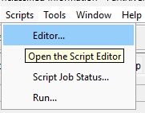
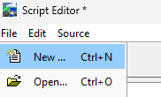
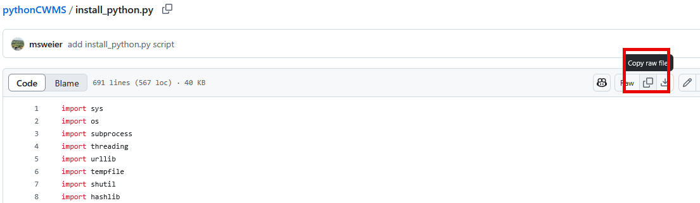
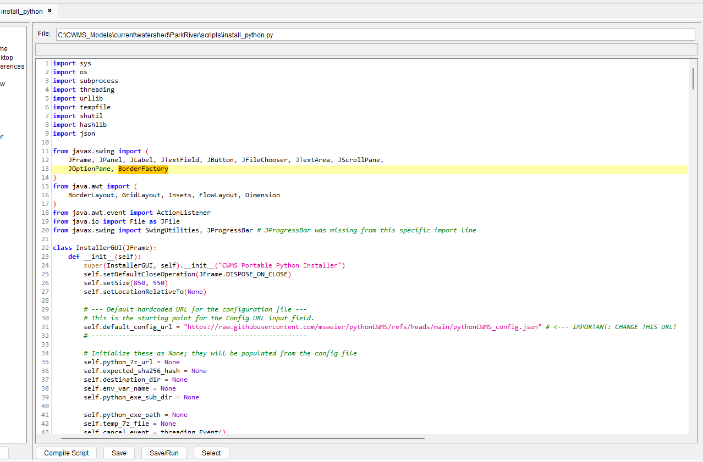
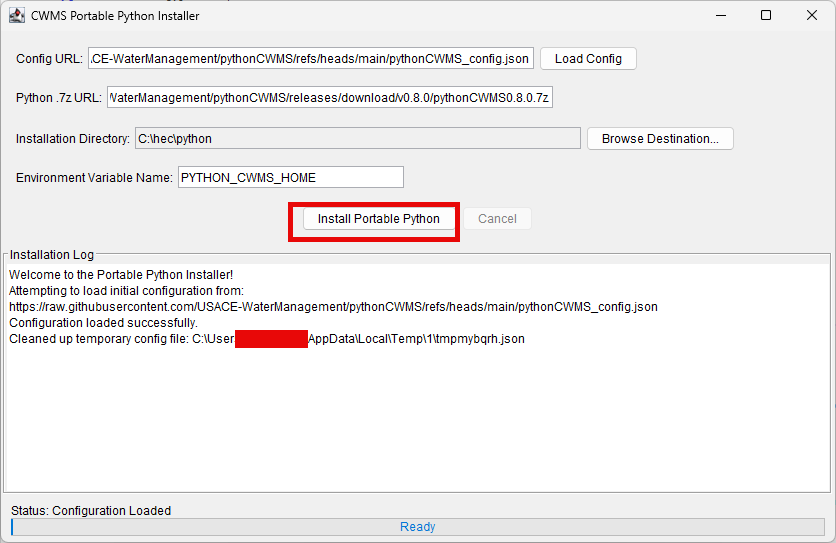

# Python CWMS Portable Environment

A portable, Windows, Python environment bundled with CWMS libraries and dependencies.

## What's Included

- **WinPython 3.12.10.1**: Portable Python distribution
- **Pre-installed Libraries**: All dependencies from `requirements_binary_only.txt`
- **Custom Configuration**: CWMS-specific setup and utilities
- **Jython installer script**: An installer that will download this python from the CWMS CAVI and setup user environment variables.

## Quick Start

### Download and Installation
Open the CAVI and script editor.

Make a new script in the CAVI called `install_python`.

Go to the [install_python.py](./jython_scripts/install_python.py) script in the `jython_scripts` folder and copy the raw script.

Paste the script into the script window.

Click `Save/Run` to launch the installer.

Click `Install Portable Python` to install. Please be patient, it may take up to 10 minutes to install.

### General Usage
- Use `pythonCWMS` in the command line to run python.
- Setup the default python in VsCode by pointing the []`python.defaultInterpreterPath`] (https://code.visualstudio.com/docs/python/settings-reference) to the installation directory (e.g. `C:\hec\python\pythonCWMS0.8.0\python`). 
- Run `WinPython Command Prompt.exe` for command line access
- Run `WinPython Interpreter.exe` for Python IDLE
- Or use `pythonCWMS.bat` for the custom CWMS environment
  
#### Install additional libraries
- To install additional libraries beyond what is in the [requirements_binary_only.txt](./requirements_binary_only.txt) file, open the WinPython powershell included in your python (e.g. `C:\hec\python\pythonCWMS0.8.0\WinPython Powershell Prompt.exe`) and do a pip install from there.

### CAVI Usage
- To run a python script in the CAVI, edit the [`example_python_script_launcher.py`](./jython_scripts/example_python_script_launcher.py) jython script to point to your python script and save in the script editor. You can pass arguments from your jython environment (e.g. watershed path etc...).

## Python Build Development

### Building Locally
1. Clone this repository
2. Create/modify `requirements_binary_only.txt` with your dependencies
3. Push a tag to trigger the build: `git tag v0.8 && git push origin v0.8`

### Manual Build
You can also trigger a build manually from the Actions tab.

## Requirements File

The `requirements_binary_only.txt` file contains all Python packages to be installed. Only binary wheels are used to ensure compatibility and faster installation.

