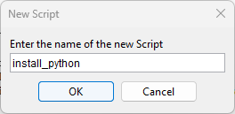
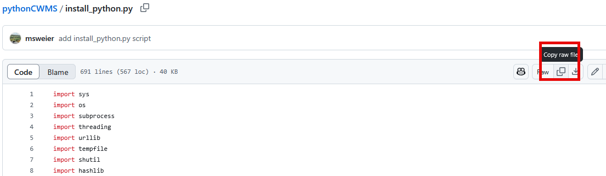
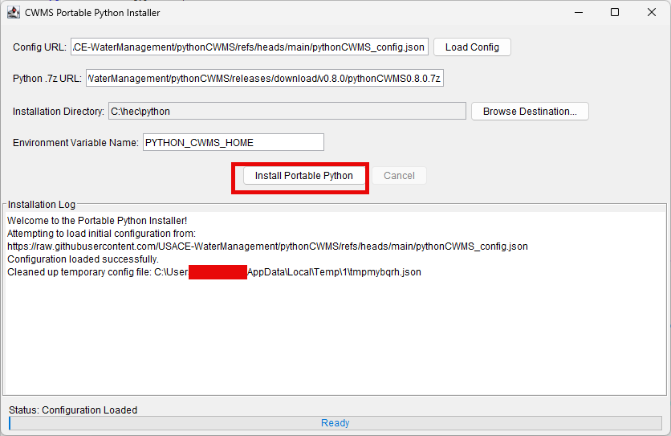
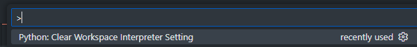

# Python CWMS Portable Environment

A portable, Windows, Python environment bundled with CWMS libraries and dependencies.

## What's Included

- **WinPython 3.13.11.0**: Portable Python distribution
- **Pre-installed Libraries**: All dependencies from requirements files
- **Custom Configuration**: CWMS-specific setup and utilities
- **Jython installer script**: An installer that will download this python from the CWMS-RTS and setup user environment variables.

## Quick Start

### Download and Installation
Open the script editor in RTS or in HEC-DSS.

Make a new script in RTS or HEC-DSS called `install_python`.

Go to the [install_python.py](./jython_scripts/install_python.py) script in the `jython_scripts` folder and copy the raw script.

Paste the script into the script window.

Click `Save and Test` to launch the installer.

Click `Install Portable Python` to install. Please be patient, it may take up to 10 minutes to install.

#### Failed to download configuration error

The installer defaults its `Config URL:` to the latest `pythonCWMS_config.json` on
`main`, and it requires an `https://` URL for both the config and the Python archive.
If you get a "Failed to download configuration" error (e.g. raw GitHub content is
blocked on your network), point `Config URL:` at the `pythonCWMS_config.json` asset of
a specific release instead (e.g. `https://github.com/USACE-WaterManagement/pythonCWMS/releases/download/v1.11/pythonCWMS_config.json`)
and reload the configuration.

Note: if the maintainer has enabled release signing (a public key is embedded in the
installer), the installer will refuse any download that does not have a valid
signature. An unsigned or tampered archive will not install.

You can also just download the latest release file (e.g. `pythonCWMS1.01.7z` (https://github.com/USACE-WaterManagement/pythonCWMS/releases/)) and unzip the portable python distribution and setup your user environment variables yourself to add the python to your path.

### General Usage
- Use `pythonCWMS` in the command line to run python.
- Setup the default python in VsCode by pointing the []`python.defaultInterpreterPath`] (https://code.visualstudio.com/docs/python/settings-reference) to the installation directory (e.g. `C:\hec\python\pythonCWMS\python`). 
- Run `WinPython Command Prompt.exe` for command line access
- Run `WinPython Interpreter.exe` for Python IDLE
- Or use `pythonCWMS.bat` for the custom CWMS environment

#### VS Code Use
To have VS Code default to this portable python, open `Preferences: Open User Settings (JSON)` by pressing `Cntr+Shift+P` and searching for Preferences in the search bar at the top of VS Code.

In your `settings.json` file, put in this  `"python.defaultInterpreterPath": "${env:PYTHON_CWMS_HOME}\\python.exe"` or this  `"python.defaultInterpreterPath": "C:\\hec\\python\\pythonCWMS\\python\\python.exe"`.

When working with a repo VSCode sometimes has trouble finding the interprator (e.g. python notebook w/ shared workspace). Try searching for `Python: Clear Workspace Interpreter Setting` by pressing `Cntr+Shift+P` and searching for Preferences in the search bar at the top of VS Code.

#### Install additional libraries
- To install additional libraries beyond what is in the [requirements_binary_only.txt](./requirements_binary_only.txt) file, open the WinPython powershell included in your python (e.g. `C:\hec\python\pythonCWMS\WinPython Powershell Prompt.exe`) and do a pip install from there.

- The command `pythonCWMS -m pip install my_package_to_install` will also work

### RTS Python Script Usage
 To use the python environment in the RTS, a jython launcher script is used to run the python script as a subprocess. The jython script can also pass arguments to the python script.

- To run a python script in the RTS, edit the `python_script_path` and `args` variables in the [`example_python_script_launcher.py`](./jython_scripts/example_python_script_launcher.py) jython script to point to your python script and save in the RTS script editor. You can pass arguments from your jython environment (e.g. watershed path etc...), but this is optional. Leave `args` as `None` or `''` if arguments are not needed.
- Output of the python script will be passed to the RTS console after the process is completed. 

## To help maintain the python builds 

See [`CONTRIBUTING.md`](CONTRIBUTING.md)
